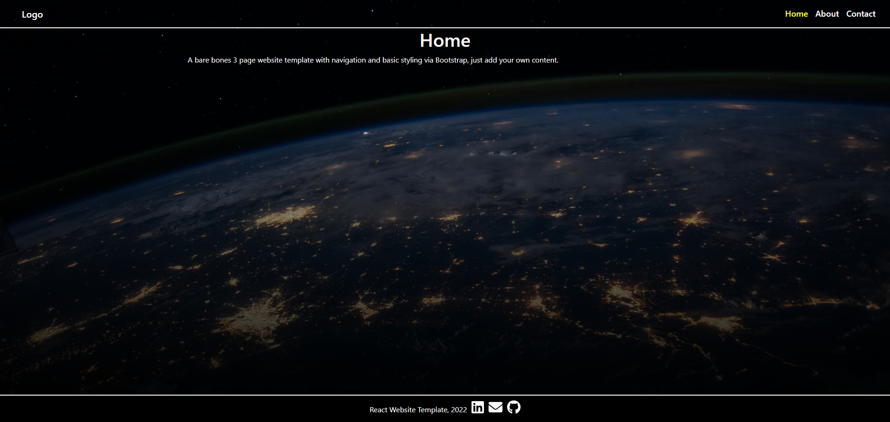

# React-blog-template

[](https://choosealicense.com/licenses/mit/)

[](https://github.com/HobbaZ/React-blog-template/commits)
[](https://github.com/HobbaZ/React-blog-template/branches)
[]()

[](https://img.shields.io/github/issues/HobbaZ/React-blog-template)


## Description
### Project Aim ###
To create a simple React blog template app.

### What Problem Does It Solve ###
Starting a React basic website website from scratch

### What I Learnt ###

## Deployment


## Table of Contents
- [Description](#description)
- [User Story](#user-story)
- [Screenshots](#screenshots)
- [Installation](#installation)
- [Features](#features)
- [Technology](#technology)
- [Contributors](#contributors)
- [Acknowledgements](#acknowledgements)
- [Testing](#testing)
- [License](#license)
- [Questions](#questions)

## User Story
Create a template for basic setup of a React SPA.

## Screenshots


## Installation
1. Clone the repo to your computer by clicking the green code button and copying the SSH version.

2. Open Gitbash in your desired folder and type ```git clone ``` then right click to paste the string and hit enter. The repo will then be cloned to your computer.

3. Navigate to the repo folder and type ```code .``` into gitbash to open the repo in VS Code.

4. Open a new Terminal in VS Code and type ```npm install``` to install the repo dependencies.

5. Finally, type ```npm start``` into the terminal and it will start the dev server at localhost:3000.

## Features

## Technology
- React
- Bootstrap
- Fontawesome

## Contributors
[Zachary Hobba](https://github.com/HobbaZ)

You can also contribute by opening a pull request or submitting an issue.

## Acknowledgements

Photo by <a href="https://unsplash.com/@nasa?utm_source=unsplash&utm_medium=referral&utm_content=creditCopyText">NASA</a> on <a href="https://unsplash.com/s/photos/website?utm_source=unsplash&utm_medium=referral&utm_content=creditCopyText">Unsplash</a>
  

Important: If you get a something is running on port 3000 error, , type ```npx kill-port 3000``` into your VS Code terminal and hit enter, will kill port 3000 and let you run the app.

## Testing
No tests for this project

## License

MIT

**Copyright 2022 Zachary Hobba**

Permission is hereby granted, free of charge, to any person obtaining a copy of this software and associated documentation files (the "Software"), to deal in the Software without restriction, including without limitation the rights to use, copy, modify, merge, publish, distribute, sublicense, and/or sell copies of the Software, and to permit persons to whom the Software is furnished to do so, subject to the following conditions:
The above copyright notice and this permission notice shall be included in all copies or substantial portions of the Software.
    
THE SOFTWARE IS PROVIDED "AS IS", WITHOUT WARRANTY OF ANY KIND, EXPRESS OR IMPLIED, INCLUDING BUT NOT LIMITED TO THE WARRANTIES OF MERCHANTABILITY, FITNESS FOR A PARTICULAR PURPOSE AND NONINFRINGEMENT. IN NO EVENT SHALL THE AUTHORS OR COPYRIGHT HOLDERS BE LIABLE FOR ANY CLAIM, DAMAGES OR OTHER LIABILITY, WHETHER IN AN ACTION OF CONTRACT, TORT OR OTHERWISE, ARISING FROM, OUT OF OR IN CONNECTION WITH THE SOFTWARE OR THE USE OR OTHER DEALINGS IN THE SOFTWARE.

## Questions

Find me on Github at [HobbaZ](https://github.com/HobbaZ)

If this has helped you with your web development, consider buying me a Coffee (only costs $3) at [zachobba](    https://buymeacoffee.com/zachobbaS)

Email me at [zachobba@gmail.com](zachobba@gmail.com)